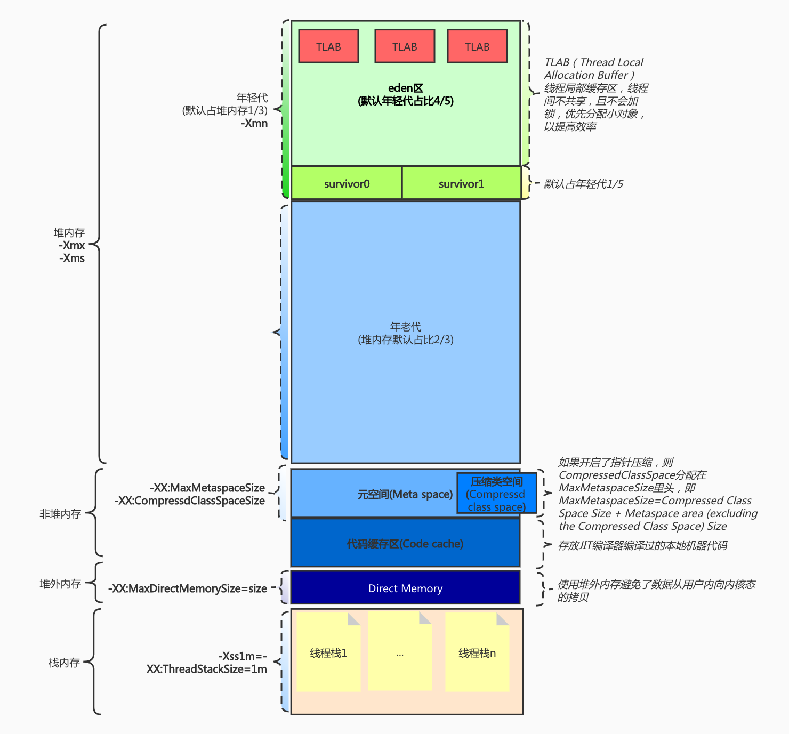

第 1 节课作业实践
1(可选)、自己写一个简单的 Hello.java，里面需要涉及基本类型，四则运行，if 和for，然后自己分析一下对应的字节码，有问题群里讨论。

[HelloByteCode.java](src/HelloByteCode.java)

2(必做)、自定义一个 Classloader，加载一个 Hello.xlass 文件，执行 hello 方法， 此文件内容是一个 Hello.class 文件所有字节(x=255-x)处理后的文件。文件群里提供。

[CustomizeClassLoader.java](src/CustomizeClassLoader.java)

3(必做)、画一张图，展示 Xmx、Xms、Xmn、Metaspache、DirectMemory、Xss 这些内存参数的关系。

4(可选)、检查一下自己维护的业务系统的 JVM 参数配置，用 jstat 和 jstack、jmap 查看一下详情，并且自己独立分析一下大概情况，思考有没有不合理的地方，如何改进。
对本地某项目压测：wrk -t20 -c200 -d30s --latency  "http://localhost:9036/xxx"
jstat -gcutil 13425 1000 100
  S0     S1     E      O      M     CCS    YGC     YGCT    FGC    FGCT    CGC    CGCT     GCT
  0.00  23.13  45.24  62.93  94.32  92.98     19    1.237     3    0.332     -        -    1.569
  0.00  23.13  58.95  62.93  94.32  92.98     19    1.237     3    0.332     -        -    1.569
  0.00  23.13  78.18  62.93  94.32  92.98     19    1.237     3    0.332     -        -    1.569
  0.00  23.13  94.11  62.93  94.32  92.98     19    1.237     3    0.332     -        -    1.569
 39.33   0.00  12.22  62.94  94.32  92.98     20    1.275     3    0.332     -        -    1.607
 39.33   0.00  26.68  62.94  94.32  92.98     20    1.275     3    0.332     -        -    1.607
 39.33   0.00  43.44  62.94  94.32  92.98     20    1.275     3    0.332     -        -    1.607
 39.33   0.00  61.16  62.94  94.32  92.98     20    1.275     3    0.332     -        -    1.607
 39.33   0.00  77.84  62.94  94.32  92.98     20    1.275     3    0.332     -        -    1.607
 39.33   0.00  93.81  62.94  94.32  92.98     20    1.275     3    0.332     -        -    1.607
  0.00  36.04   6.99  62.94  94.32  92.98     21    1.354     3    0.332     -        -    1.686
  0.00  36.04  25.50  62.94  94.32  92.98     21    1.354     3    0.332     -        -    1.686
  0.00  36.04  46.23  62.94  94.32  92.98     21    1.354     3    0.332     -        -    1.686
  0.00  36.04  67.31  62.94  94.32  92.98     21    1.354     3    0.332     -        -    1.686

对象创建都是在Eden和survivor区轮转，基本没有进入到old区

jmap -heap 13425
Attaching to process ID 13425, please wait...
Debugger attached successfully.
Server compiler detected.
JVM version is 25.191-b12

using thread-local object allocation.
Parallel GC with 4 thread(s)    (使用并行GC收集器，4个GC线程)

Heap Configuration:
   MinHeapFreeRatio         = 0
   MaxHeapFreeRatio         = 100
   MaxHeapSize              = 2099249152 (2002.0MB)(最大堆内存=8G/4)
   NewSize                  = 44040192 (42.0MB)
   MaxNewSize               = 699400192 (667.0MB)(年轻代最大内存=2002.0MB/3)
   OldSize                  = 88080384 (84.0MB)
   NewRatio                 = 2
   SurvivorRatio            = 8
   MetaspaceSize            = 21807104 (20.796875MB)
   CompressedClassSpaceSize = 1073741824 (1024.0MB)
   MaxMetaspaceSize         = 17592186044415 MB
   G1HeapRegionSize         = 0 (0.0MB)

Heap Usage:
PS Young Generation (年轻代，因为默认有自适应，区容量会动态变化)
Eden Space:（伊甸区）
   capacity = 371195904 (354.0MB)
   used     = 107731984 (102.74122619628906MB)
   free     = 263463920 (251.25877380371094MB)
   29.022945253189% used
From Space:（survivor0）
   capacity = 11010048 (10.5MB)
   used     = 11005792 (10.495941162109375MB)
   free     = 4256 (0.004058837890625MB)
   99.96134440104167% used
To Space:（survivor1）
   capacity = 17825792 (17.0MB)
   used     = 0 (0.0MB)
   free     = 17825792 (17.0MB)
   0.0% used
PS Old Generation
   capacity = 192413696 (183.5MB)
   used     = 56170336 (53.568206787109375MB)
   free     = 136243360 (129.93179321289062MB)
   29.192483262729905% used

47470 interned Strings occupying 4855000 bytes.

jstack 13425
可以看到有限时等待任务（TIMED_WAITING），因为lettuce客户端异步查询redis
"http-nio-9042-exec-41" #194 daemon prio=5 os_prio=31 tid=0x00007ff9478bc000 nid=0x12803 waiting on condition [0x00007000119de000]
   java.lang.Thread.State: TIMED_WAITING (parking)
	at sun.misc.Unsafe.park(Native Method)
	- parking to wait for  <0x0000000796879670> (a java.util.concurrent.CompletableFuture$Signaller)
	at java.util.concurrent.locks.LockSupport.parkNanos(LockSupport.java:215)
	at java.util.concurrent.CompletableFuture$Signaller.block(CompletableFuture.java:1695)
	at java.util.concurrent.ForkJoinPool.managedBlock(ForkJoinPool.java:3323)
	at java.util.concurrent.CompletableFuture.timedGet(CompletableFuture.java:1775)
	at java.util.concurrent.CompletableFuture.get(CompletableFuture.java:1915)
	at io.lettuce.core.protocol.AsyncCommand.await(AsyncCommand.java:83)
	at io.lettuce.core.LettuceFutures.awaitOrCancel(LettuceFutures.java:112)
	at io.lettuce.core.FutureSyncInvocationHandler.handleInvocation(FutureSyncInvocationHandler.java:69)
	at io.lettuce.core.internal.AbstractInvocationHandler.invoke(AbstractInvocationHandler.java:80)
	at com.sun.proxy.$Proxy302.get(Unknown Source)
	at org.springframework.data.redis.connection.lettuce.LettuceStringCommands.get(LettuceStringCommands.java:66)

第 2 节课作业实践
1、本机使用 G1 GC 启动一个程序，仿照课上案例分析一下 JVM 情况
java -jar gateway-server-0.0.1-SNAPSHOT.jar -XX+UseG1GC

jmap -heap 17942
Attaching to process ID 17942, please wait...
Debugger attached successfully.
Server compiler detected.
JVM version is 25.191-b12

using thread-local object allocation.
Garbage-First (G1) GC with 4 thread(s) (使用G1垃圾回收器，4个GC线程)

Heap Configuration:
   MinHeapFreeRatio         = 40 （空闲堆最小百分比）
   MaxHeapFreeRatio         = 70 （空闲堆最大百分比）
   MaxHeapSize              = 2099249152 (2002.0MB)（堆总大小）
   NewSize                  = 1363144 (1.2999954223632812MB)（年轻代大小）
   MaxNewSize               = 1259339776 (1201.0MB)（年轻代最大大小）
   OldSize                  = 5452592 (5.1999969482421875MB)（老年代最小值）
   NewRatio                 = 2
   SurvivorRatio            = 8
   MetaspaceSize            = 21807104 (20.796875MB)
   CompressedClassSpaceSize = 1073741824 (1024.0MB)
   MaxMetaspaceSize         = 17592186044415 MB
   G1HeapRegionSize         = 1048576 (1.0MB)（每个Region大小）

Heap Usage:
G1 Heap:
   regions  = 2002  (region数量)
   capacity = 2099249152 (2002.0MB)
   used     = 83362288 (79.50047302246094MB)
   free     = 2015886864 (1922.499526977539MB)
   3.971052598524522% used
G1 Young Generation:
Eden Space:
   regions  = 54    (年轻代Region数量)
   capacity = 76546048 (73.0MB)
   used     = 56623104 (54.0MB)
   free     = 19922944 (19.0MB)
   73.97260273972603% used
Survivor Space:
   regions  = 6 
   capacity = 6291456 (6.0MB)
   used     = 6291456 (6.0MB)
   free     = 0 (0.0MB)
   100.0% used
G1 Old Generation:
   regions  = 20
   capacity = 49283072 (47.0MB)
   used     = 20447728 (19.500473022460938MB)
   free     = 28835344 (27.499526977539062MB)
   41.49036813289561% used

16032 interned Strings occupying 2155968 bytes.

### link:[课堂笔记 ](src/课堂笔记.txt)